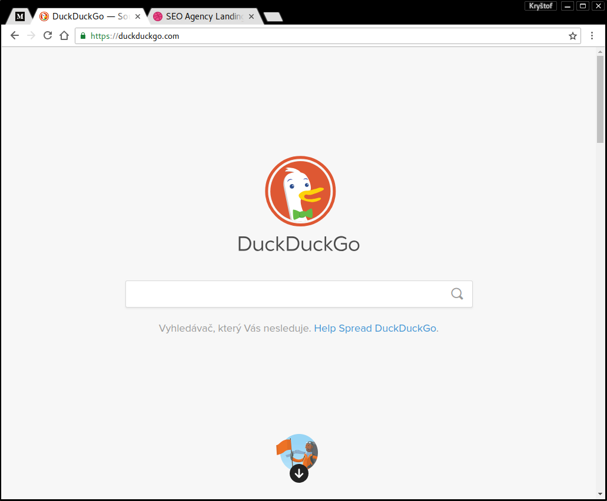

Pure dark
=========

Purest google-chrome theme

# Screenshot

# Instalation

* go to chrome://extensions
* enable "Developers mode"
* click to "Pack extension..."
* select root ".../pure-dark-theme/1.0_0"
* pack
* drop file 1.0_0.crx to new tab in browser
